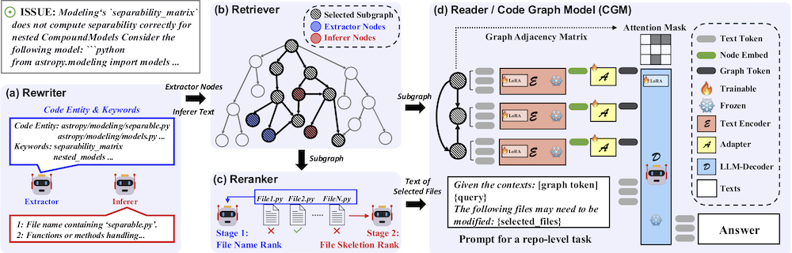
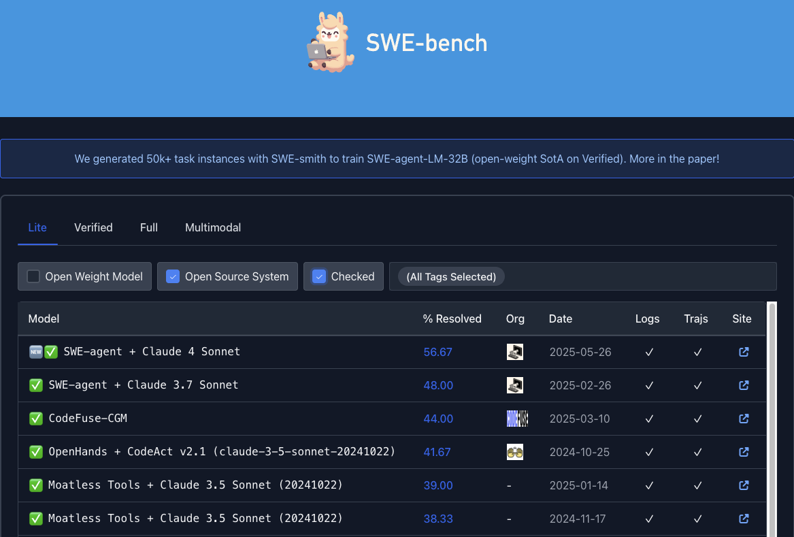

<li>

CGM: We are pleased to announce the updated version of the CGM-72B-V1.2. The model further achieves a remarkable 44.00% resolve rate on the SWE-Bench-Lite leaderboard.[CGM](https://huggingface.co/inclusionAI/Ling-Coder-lite)
</li>

<!-- 

<li>

Ling-Coder-Lite, available on [GitHub](https://github.com/codefuse-ai/Ling-Coder-Lite) and [HuggingFace](https://huggingface.co/inclusionAI/Ling-Coder-lite). This model is based on the Ant Ling-MoE architecture. Additionally, the [technical report](https://arxiv.org/abs/2503.17793), [SFT dataset](https://huggingface.co/datasets/inclusionAI/Ling-Coder-SFT) and [DPO dataset](https://huggingface.co/datasets/inclusionAI/Ling-Coder-DPO) are also openly accessible. 
</li>

 -->

&nbsp;

<strong>Ling-Coder-Lite</strong> 

&nbsp;

We have open-sourced our latest MoE code LLM, Ling-Coder-Lite, available on <a href="https://github.com/codefuse-ai/Ling-Coder-Lite">GitHub</a> and <a href="https://huggingface.co/inclusionAI/Ling-Coder-lite">HuggingFace</a>. This model is based on the Ant Ling-MoE architecture. Additionally, the technical report <a href="https://arxiv.org/abs/2503.17793">https://arxiv.org/abs/2503.17793</a> , <a href="https://huggingface.co/datasets/inclusionAI/Ling-Coder-SFT">SFT dataset</a> and <a href="https://huggingface.co/datasets/inclusionAI/Ling-Coder-DPO">DPO dataset</a> are also openly accessible.

<!-- 

<li>
 -->
 

&nbsp;

<strong>CodeFuse</strong> 

&nbsp;

CodeFuse is an advanced pretrained code Large Language Model (LLM) developed by our team at AntGroup. Designed to integrate seamlessly into real-world industrial scenarios, CodeFuse aims to significantly enhance the effectiveness and efficiency of software development. By leveraging the power of LLMs, CodeFuse provides developers with intelligent code suggestions, automates repetitive tasks, and offers deep insights into code quality and best practices. To foster innovation and collaboration, we have open-sourced CodeFuse, making it accessible to the broader developer community.

 

CodeFuse has been open-sourced on <a href="https://github.com/codefuse-ai">GitHub</a>&nbsp;and <a href="https://huggingface.co/codefuse-ai">HuggingFace</a>. The technical report has been published on <a href="https://arxiv.org/abs/2310.06266">https://arxiv.org/abs/2310.06266</a>.

<!-- </li>

 -->

<li>

MindSpore/AKG: also known as the Automatic Kernel Generator, is a component of the MindSpore framework, which is an open-source machine learning (ML) platform developed by Huawei. AKG plays a crucial role in optimizing the performance of neural network operations on various hardware platforms, including CPUs, GPUs, and specialized AI accelerators like Ascend.
([GitHub](https://github.com/mindspore-ai/akg), [Gitee](https://github.com/mindspore-ai/akg)) which is an open-sourced AI compiler for Huawei Ascend 910.
</li>

<li>

SVF (Static Value-Flow Analysis Framework) is a prominent open-source tool designed for static program analysis. It is widely used in software engineering and programming language research to analyze how data values flow throughout a program. By providing powerful static analysis capabilities, SVF enables developers and researchers to better understand program behavior, detect software vulnerabilities, optimize compilers, and improve program verification. [SVF](http://svf-tools.github.io/SVF/).
</li>

